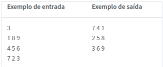
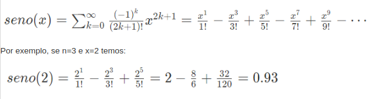
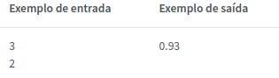
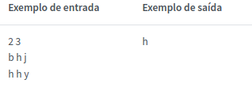

# Questões

### Giro da Matriz 
Escreva um programa na linguagem C que recebe uma matriz quadrada de dimensão n>0​ e efetua um giro como no exemplo de entrada e saída abaixo.Observe que o exemplo trata uma matriz de dimensão 3x3, porém, o programa deve manipular uma matriz de dimensão n.O giro deve ser efetuado por uma função que recebe uma matriz e atualiza seus valores. A função não deve exibir valores na saída padrão.

### Seno
Escreva um programa na linguagem C que calcula a aproximação da função seno, dada pela sequência abaixo, e o exibe com duas casas decimais. O programa deve receber como entrada a quantidade n>0​, indicando a quantidade de termos somados na sequência, e o valor de x​, em que a função será avaliada.

### Repetição em Matriz
Escreva um programa em C que recebe as dimensões de uma matriz de caracteres e seus elementos, e determina o valor que mais se repete na matriz. O programa deve ter uma função que recebe a matriz e retorna o valor que mais se repete. Caso ocorram empates, somente um dos valores empatados deve ser retornado, não importa qual. A função não deve exibir valores na saída padrão.

