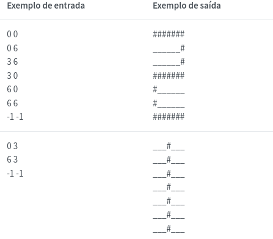
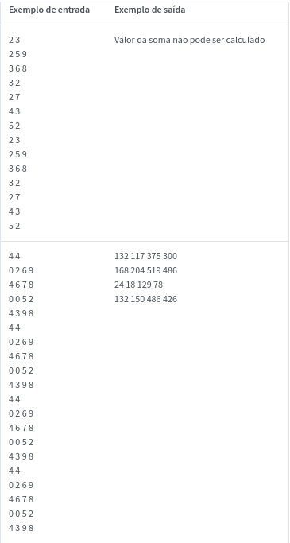

# Questões de matriz
## Matriz como vetor

Em C, uma matriz declarada estaticamente é alocada em uma região contínua na memória, em um único bloco de memória no computador. Ou seja, mesmo que a matriz tenha duas (ou mais) dimensões, ela será armazenada em uma sequência de endereços como se fosse um vetor (array de uma única dimensão).

Logo, podemos alocar um vetor com 100 valores inteiros e acessá-lo como se fosse uma matriz de 10x10... ou 20x5... ou 4x25... Isso significa que, dependendo das dimensões da matriz, o elemento que se encontra por exemplo na 2ª linha e 2ª coluna será diferente.

Veja por exemplo o vetor de 6 elementos:  1, 2, 3, 4, 5, 6. Se ele for tratado como uma matriz 2x3, será:

1 2 3

4 5 6

...e o elemento na 2ª linha e 2ª coluna será 5. Porém, se ele for tratado como uma matriz 3x2, será:

1 2

3 4

5 6

...e o elemento na 2ª linha e 2ª coluna será 4. 

Escreva um programa que lê da entrada-padrão uma sequência de valores e armazena-os em um vetor (array de uma única dimensão) e imprime o valor correspondente a uma determinada posição, como se os valores estivessem em uma matriz de determinada dimensão (no exemplo acima, a posição indicada corresponde ao valor 5 se fosse uma matriz 2x3 ou 4 se fosse 3x2).

A entrada de dados consiste em quatro linhas. A primeira indica a quantidade N de valores a serem lidos no array. A segunda linha contém os N valores inteiros do array. A terceira linha contém dois valores inteiros correspondentes ao número de linhas (L) e colunas da matriz (C) (a relação L x C = N será sempre verdadeira). Por fim, a quarta linha contém o índice da linha e da coluna do valor a ser consultado (o índice inicial é 0!). Seu programa deve enviar para a saída de dados o valor consultado.

|Exemplo de entrada|  Exemplo de saída|
|-------------------|----------------|
|6  1 2 3 4 5 6  2 3 1 1|             5 |
|6 1 2 3 4 5 6 3 2 1 1|       4    |

## Giro da matriz
Criar um algoritmo que entre com valores inteiros para uma matriz m 3 x 3 e imprima

a matriz final, conforme mostrado a seguir:

[ 1  8  9

  4  5  6

  7  2  3 ]

a matriz gira 90º

[  7  4  1 

  2   5  8

  3   6  9]

|Exemplo de entrada|  Exemplo de saída|
|-------------------|----------------|
| 1 8 9 4 5 6 7 2 3 | 7 4 1 2 5 8  3 6 9|
| 3 5 0 2 3 4 1 7 8|1 2 3 7 3 5 8 4 0|

## Desenhando em uma matriz de pixels

Em processamento de imagens, a estrutura de dados de uma imagem é na forma de uma matriz de pixels, onde cada célula da matriz possui o valor da cor do pixel naquela posição da imagem. Neste exercício trabalharemos com uma imagem de 7 por 7 pixels para representar os dígitos (0 a 9) em preto e branco. Assim, os valores dos pixels assumem apenas dois valores, 1 para preto e 0 para branco. As coordenadas (linha, coluna) da imagem correspondem aos índices da matriz, isto é, a célula (0,0) da matriz reflete a coordenada superior esquerda, e (6,6) a coordenada inferior direita da imagem. 

Crie uma programa que trace linhas pretas horizontais ou verticais na imagem a partir de comandos de movimentação de um cursor pincel imaginário. Por exemplo, para 'desenharmos' o dígito 2 a partir da coordenada (0,0) devemos informar:

0 0

0 6

3 6

3 0

6 0

6 6

O programa deve parar a movimentação do pincel imaginário quando o usuário informar a coordenada: -1 -1. Assim, para desenhar o dígito 1 no centro da imagem, o usuário informa:

0 3

6 3

-1 -1

Após a movimentação do cursor o programa deve imprimir a imagem colocando um tracejado ('_') quando o pixel for branco e um jogo da velha ('#') quando o pixel for preto. Use pelo menos uma função para imprimir a imagem passando a matriz como argumento.

## Expressão com matrizes e funções

Escreva um programa para resolver a expressão

    R=M1∗M2+M2∗M3+M3∗M4R = M_1 * M_2 + M_2 * M_3 + M_3 * M_4R=M1​∗M2​+M2​∗M3​+M3​∗M4​​​

Onde M1, M2, M3 e M4 são matrizes de números inteiros, que serão fornecidas ao programa.

Um ponto importante a notar é que expressão de multiplicação se repete 3 vezes e a de adição se repete duas vezes. Assim esse caso é um bom exemplo em que podemos aplicar funções para deixar o programa muito mais claro bem como muito mais fácil de corrigir no caso de erros.

Para resolver escreva, pelo menos, duas funções:

    multiplica duas matrizes A e B e guarda o resultado em R
    void mult_mat(int lA, int cA, int A[lA][cA], int lB, int cB, int B[lB][cB], int R[lA][cB])

    soma duas matrizes A e B e guarda o resultado em R
    void add_mat(int lA, int cA, int A[lA][cA], int lB, int cB, int B[lB][cB], int R[lB][cB])
    A entrada do programa é composta por duas partes:

A entrada do programa é composta por duas partes:

    1. A primeira linha é o tamanho da matriz L C;

        2. As linhas que seguem são os valores da matriz;

             3. As informações 1 e 2 se repetem 4 vezes, 1 para cada matriz do problema.

A saída do programa é dividida em dois tipos:

    1. O valor de R, no formato similar ao formato da entrada;

    2. Uma mensagem se a expressão não pode ser calculada, que pode ser uma das condições abaixo:
        
        a) Alguma das multiplicações não pode ser realizada. Neste caso o programa imprime: "Valor de alguma das multiplicações não pode ser calculado";

        b)Alguma das três matrizes resultado das multiplicações tem tamanho diferente das demais. Neste caso o programa imprime: "Valor da soma não pode ser calculado".

